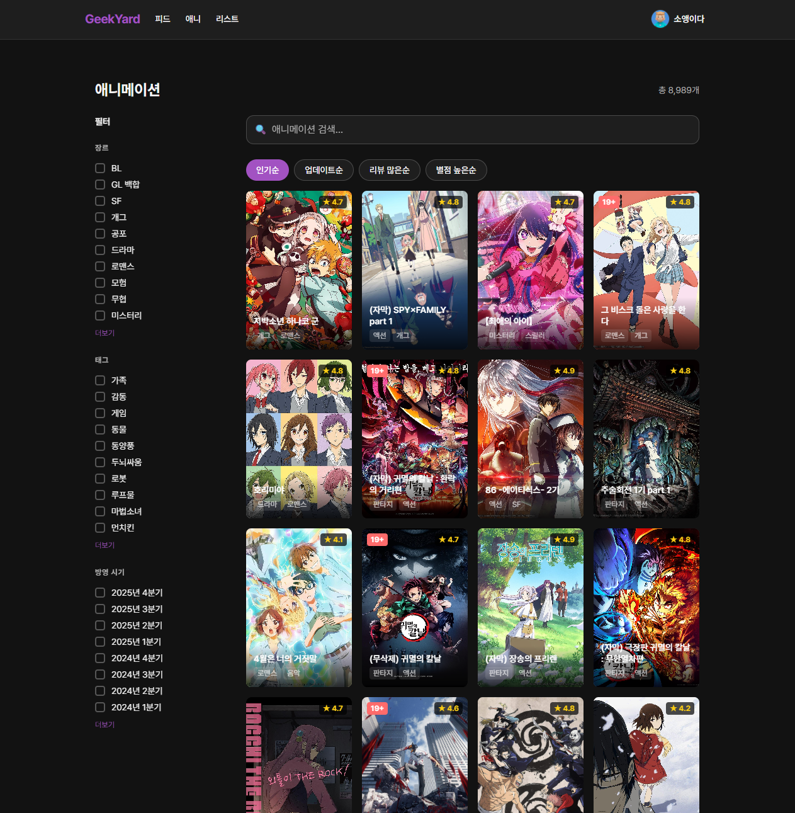
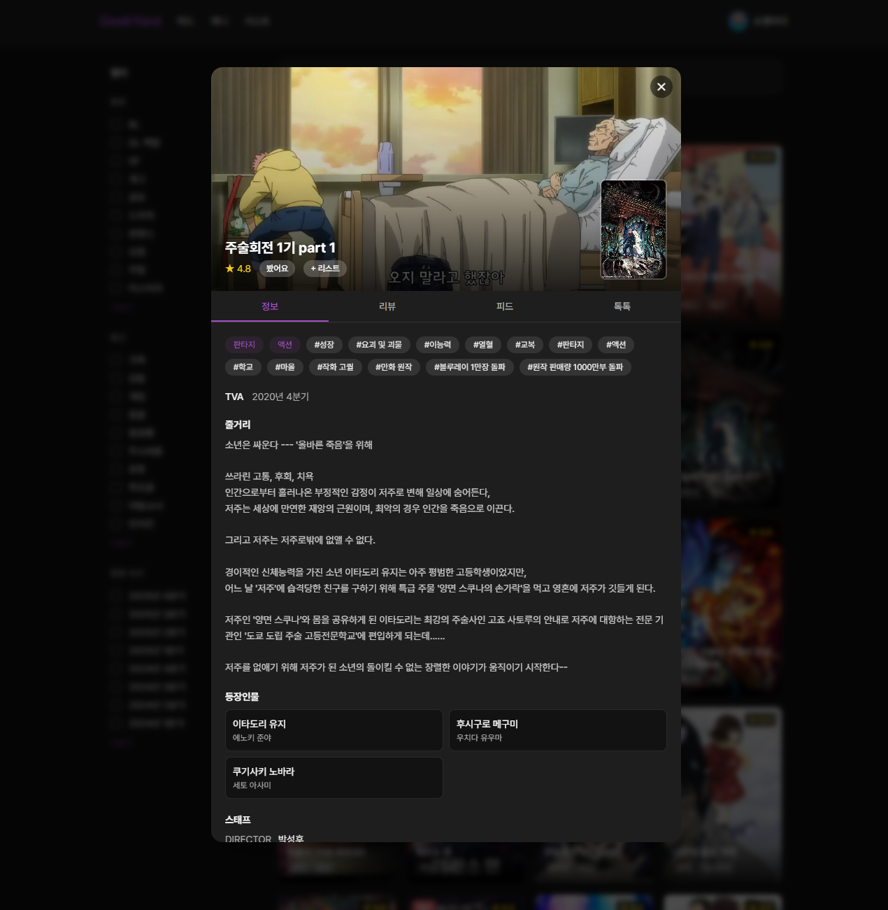
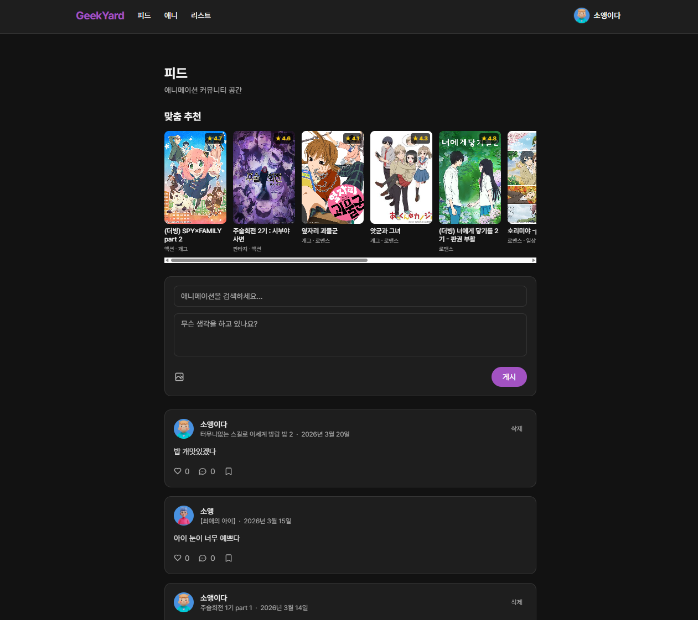
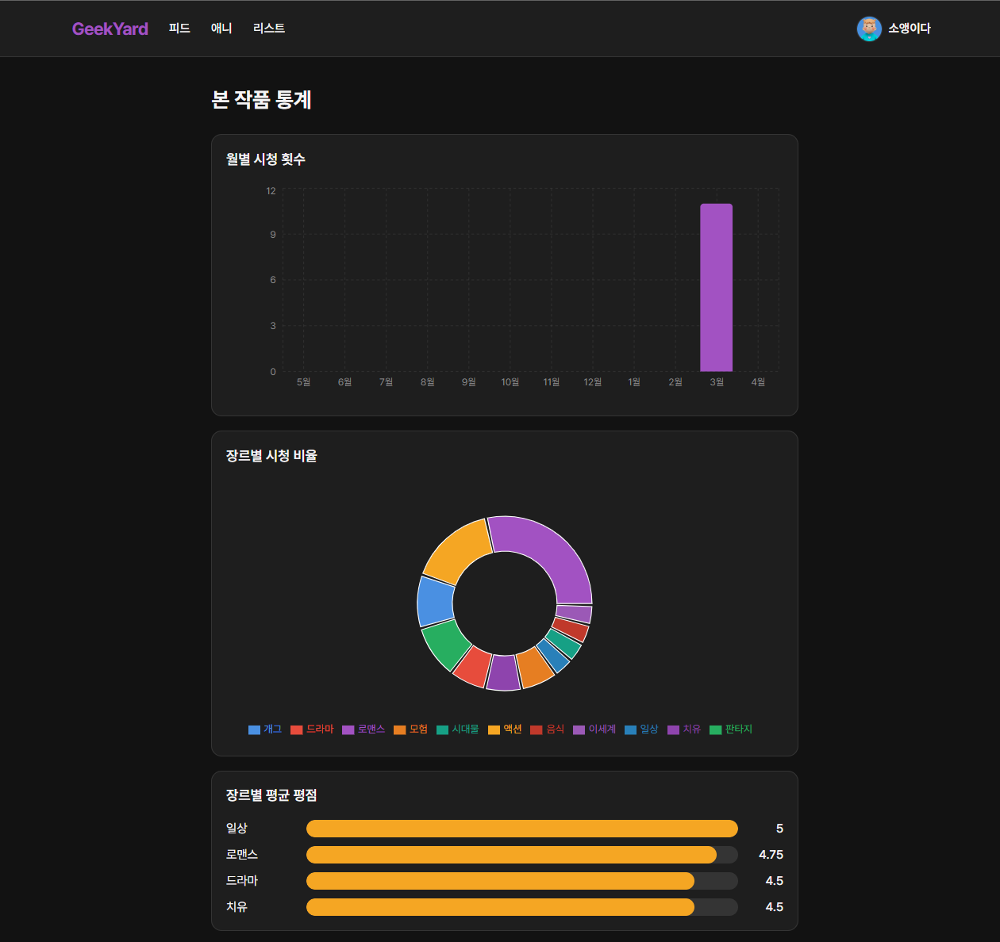

# Geekyard

<div align="center">

**애니메 커뮤니티 플랫폼 — 보고, 기록하고, 이야기하세요.**

[](https://github.com/soaengry/geekyard/actions/workflows/ci.yml)
[](https://github.com/soaengry/geekyard/actions/workflows/deploy-staging.yml)
[](https://github.com/soaengry/geekyard/actions/workflows/deploy-production.yml)
[](https://openjdk.org/projects/jdk/17/)
[](https://spring.io/projects/spring-boot)
[](https://react.dev/)
[](https://www.typescriptlang.org/)
[](./LICENSE)

</div>

---

## 목차

- [소개](#소개)
- [스크린샷](#스크린샷)
- [기술 스택](#기술-스택)
- [아키텍처](#아키텍처)
- [시작하기](#시작하기)
- [프로젝트 구조](#프로젝트-구조)
- [배포](#배포)
- [기여 가이드](#기여-가이드)
- [라이선스](#라이선스)

---

## 소개

Geekyard는 애니메이션 팬을 위한 커뮤니티 플랫폼입니다.

| 기능        | 설명                                          |
| ----------- | --------------------------------------------- |
| 검색 & 탐색 | 장르 · 태그 · 연도별 필터링, 유사 작품 추천   |
| 시청 기록   | 캘린더 · 통계로 시청 이력 관리                |
| 리뷰 & 평점 | 별점과 감상 공유, 좋아요                      |
| 피드        | 이미지 포함 감상 공유, 댓글 · 좋아요 · 북마크 |
| 컬렉션      | 테마별 애니메 리스트 생성 & 공유              |
| 실시간 채팅 | 작품별 채팅방 (STOMP WebSocket)               |
| AI 추천     | 장르 선호도 기반 맞춤 추천                    |
| 소셜 로그인 | Google · Kakao · Naver OAuth2                 |

---

## 스크린샷

[ 애니메이션 탐색]


[ 애니메이션 상세]


[ 피드 페이지 ]


[ 시청 통계 ]


---

## 기술 스택

| 영역         | 기술                                                       |
| ------------ | ---------------------------------------------------------- |
| **Backend**  | Java 17, Spring Boot 3.5, Spring Security, Spring Data JPA |
| **Frontend** | React 19, TypeScript 5.7, Vite 6, Tailwind CSS 3.4         |
| **Database** | PostgreSQL 17, MongoDB 7, Redis 7                          |
| **Auth**     | JWT (HS256), OAuth2 (Google · Kakao · Naver)               |
| **Storage**  | AWS S3                                                     |
| **Realtime** | WebSocket (STOMP)                                          |
| **Infra**    | Docker, Nginx, EC2, Vercel, GitHub Actions                 |

---

## 아키텍처

```
                        ┌──────────────────────────┐
                        │        Client (Browser)  │
                        │  React 19 + Vite + TS    │
                        │   [EC2 / Nginx 서빙]      │
                        └────────────┬─────────────┘
                                     │ HTTPS / WebSocket
                        ┌────────────▼─────────────┐
                        │    Nginx (Reverse Proxy)  │
                        └────────────┬─────────────┘
                                     │
                        ┌────────────▼─────────────┐
                        │  Spring Boot 3.5 API      │
                        │   :8080  [EC2]            │
                        └──┬──────┬──────┬──────────┘
                           │      │      │
              ┌────────────▼──┐ ┌─▼───┐ ┌▼──────────┐
              │  PostgreSQL   │ │Redis│ │  MongoDB  │
              │  (main DB)    │ │cache│ │  (chat)   │
              └───────────────┘ └─────┘ └───────────┘
                                              │
                                    ┌─────────▼──────────┐
                                    │  AWS S3 (images)   │
                                    └────────────────────┘
```

### 도메인 구조 (DDD)

| 도메인      | 설명                                       |
| ----------- | ------------------------------------------ |
| `user`      | 회원가입, 로그인, 프로필, 시청 통계/캘린더 |
| `anime`     | 애니메 정보, 필터, 리뷰, 추천              |
| `animelist` | 개인 애니메 컬렉션                         |
| `feed`      | 피드 작성/조회, 댓글, 좋아요, 북마크       |
| `chat`      | 작품별 실시간 채팅                         |

---

## 시작하기

### 사전 요구사항

| 도구                    | 버전      |
| ----------------------- | --------- |
| Java (JDK)              | 17+       |
| Node.js                 | 20+       |
| Docker & Docker Compose | 최신 버전 |
| PostgreSQL              | 17+       |
| MongoDB                 | 7+        |
| Redis                   | 7+        |

### 1. 레포지토리 클론

```bash
git clone https://github.com/soaengry/geekyard.git
cd geekyard
```

### 2. 인프라 실행 (Docker)

```bash
# PostgreSQL, MongoDB, Redis 로컬 실행
docker run -d --name pg -e POSTGRES_PASSWORD=password -e POSTGRES_DB=geekyard -p 5432:5432 postgres:15
docker run -d --name mongo -p 27017:27017 mongo:7
docker run -d --name redis -p 6379:6379 redis:7-alpine
```

### 3. 환경변수 설정

```bash
cp infra/.env.example backend/.env
```

`backend/.env`를 열어 값을 채워주세요:

```env
POSTGRESQL_DATABASE=geekyard
POSTGRESQL_USERNAME=postgres
POSTGRESQL_PASSWORD=password
REDIS_HOST=localhost
REDIS_PORT=6379
MONGODB_URI=mongodb://localhost:27017/geekyard
JWT_SECRET=your-256-bit-secret-key
MAIL_USERNAME=your@gmail.com
MAIL_PASSWORD=your-app-password
GOOGLE_CLIENT_ID=...
GOOGLE_CLIENT_SECRET=...
KAKAO_CLIENT_ID=...
KAKAO_CLIENT_SECRET=...
NAVER_CLIENT_ID=...
NAVER_CLIENT_SECRET=...
AWS_S3_BUCKET=your-bucket
AWS_ACCESS_KEY=...
AWS_SECRET_KEY=...
```

```bash
cp frontend/.env.example frontend/.env   # 없을 경우 직접 생성
```

`frontend/.env`:

```env
VITE_API_BASE_URL=http://localhost:8080
VITE_OAUTH2_BASE_URL=/oauth2/authorization
```

### 4. 백엔드 실행

```bash
cd backend
./gradlew bootRun
# API: http://localhost:8080
```

### 5. 프론트엔드 실행

```bash
cd frontend
npm install
npm run dev
# App: http://localhost:3000
```

---

## 프로젝트 구조

```
geekyard/
├── .github/
│   └── workflows/
│       ├── ci.yml                   # PR 테스트 (backend + frontend)
│       ├── deploy-staging.yml       # dev → staging 자동 배포
│       └── deploy-production.yml    # main → production 자동 배포
│
├── backend/                         # Spring Boot API
│   └── README.md
│
├── frontend/                        # React SPA
│   └── README.md
│
├── infra/
│   ├── docker-compose.staging.yml
│   ├── docker-compose.production.yml
│   ├── deploy.sh
│   ├── .env.example
│   ├── DEPLOY-GUIDE.md
│   └── nginx/
│       ├── nginx.conf
│       ├── nginx.prod.conf
│       ├── docker-compose.staging.yml
│       ├── docker-compose.production.yml
│       ├── deploy.sh
│       └── DEPLOY-GUIDE.md
│
└── README.md                        # 이 파일
```

---

## 배포

### 환경별 브랜치 전략

| 브랜치 | 환경       | 트리거            |
| ------ | ---------- | ----------------- |
| `dev`  | Staging    | push              |
| `main` | Production | push (PR 승인 후) |

### CI/CD 파이프라인

```
PR 생성 → CI (테스트 + 린트) → 머지 → 자동 배포 → 헬스체크 → 완료
                                                 ↓ (실패 시)
                                              자동 롤백
```

자세한 배포 방법은 [infra/DEPLOY-GUIDE.md](./infra/DEPLOY-GUIDE.md)를 참고하세요.

---

## 기여 가이드

### 브랜치 전략

```bash
# dev 브랜치에서 feature 브랜치 생성
git checkout dev
git pull origin dev
git checkout -b feat/my-feature
```

### 커밋 컨벤션

```
[<type>] <scope>: <short summary>
```

| type       | 설명                      |
| ---------- | ------------------------- |
| `feat`     | 새 기능                   |
| `fix`      | 버그 수정                 |
| `refactor` | 리팩토링 (동작 변경 없음) |
| `style`    | 포맷, 린트                |
| `docs`     | 문서 수정                 |
| `test`     | 테스트 추가/수정          |
| `chore`    | 빌드, 설정                |

**예시:**

```
[feat] auth: add email verification flow
[fix] feed: resolve image upload size limit
[refactor] global: extract useSentinelObserver hook
```

### PR 프로세스

1. `dev` 브랜치 기준으로 `feat/<scope>-<description>` 브랜치 생성
2. 변경 사항 개발 및 커밋
3. `dev`로 Pull Request 생성
4. CI 통과 확인 (테스트 + 린트)
5. 코드 리뷰 후 머지

### 로컬 테스트

```bash
# 백엔드 테스트
cd backend && ./gradlew test

# 프론트엔드 린트
cd frontend && npm run lint
```

> **규칙:** `dev`, `main`에 직접 커밋하지 마세요. 반드시 PR을 통해 머지하세요.

---

## 라이선스

이 프로젝트는 [MIT 라이선스](./LICENSE)를 따릅니다.

---

<div align="center">
  Made with ❤️ by <a href="https://github.com/soaengry">soaengry</a>
</div>
